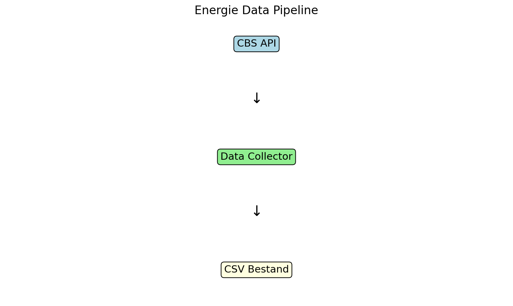
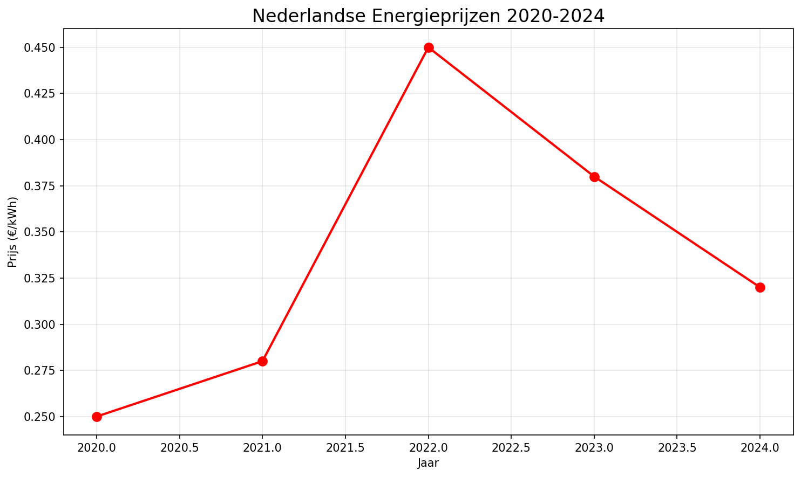

# 🔌 Nederlandse Energiedata Pipeline

## 📋 Project Overzicht
Dit project verzamelt Nederlandse energieprijzen via CBS API en analyseert trends.



## 🛠️ Technische Stack
- Python 3.x
- pandas (data processing)
- requests (API calls)
- matplotlib (visualisaties)

## 📊 Voorbeeld Resultaat


## 🚀 Installatie & Gebruik

```bash
# Installeer packages
pip install pandas requests matplotlib

# Run data collector
python data_collector.py